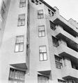
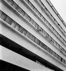
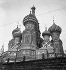

| URL | Date | Measurement | Description | Thumbnail |
| --- | ---- | ----------- | ----------- | --------- |
| [Link](https://idp.bl.uk/collection/009A84D902F0404581F1583E5B3D49FC/) | 1933 to 1934 | height 6.1 centimetres, width 6.1 centimetres | HERAT (W.Afghanistan) |  |
| [Link](https://idp.bl.uk/collection/5FF830EE978E43C49DB7BF9B8729FBF9/) | 1933 to 1934 | height 8.2 centimetres, width 10.8 centimetres | ISFAHAN Masjid-i-Jami. |  |
| [Link](https://idp.bl.uk/collection/D1AD1172C2F44EB8AC73F49FA62B17F0/) | 1933 to 1934 | height 10.8 centimetres, width 8.2 centimetres | ISFAHAN. Masjid-i-Jami. |  |
| [Link](https://idp.bl.uk/collection/716E6E763BD24C389A7E5F3D92100030/) | 1933 to 1934 | height 6.1 centimetres, width 6 centimetres | ISFAHAN |  |
| [Link](https://idp.bl.uk/collection/523F4D1E0EB142DC944D4B1CC21847EA/) | 1933 to 1934 | height 6.2 centimetres, width 6 centimetres | PERSEPOLIS. Section of fallen capital. |  |
| [Link](https://idp.bl.uk/collection/3C3AC7D531684123B5EC374ECCD72B9D/) | 1933 to 1934 | height 10.8 centimetres, width 8.2 centimetres | Radkan |  |
| [Link](https://idp.bl.uk/collection/86E7B4EA203E4A01BFE245D287818DEC/) | 1933 to 1934 | height 6.2 centimetres, width 6 centimetres | RAY |  |
| [Link](https://idp.bl.uk/collection/456DD3C0CB794DE0A77B929EE54B95EF/) | 1933 to 1934 | height 10.8 centimetres, width 8.2 centimetres | SHAPUR. Rock carvings. Sassanian. Details of carving. |  |
| [Link](https://idp.bl.uk/collection/0D48669FE1A0490AA0BB3CFC42E0C226/) | 1933 to 1934 | height 10.8 centimetres, width 8.2 centimetres | SHIRAZ. Tomb of Hafiz. |  |
| [Link](https://idp.bl.uk/collection/060F7D7853F742708338871F7536F8AA/) | 1933 to 1934 | height 10.8 centimetres, width 8.2 centimetres | VERAMIN |  |
| [Link](https://idp.bl.uk/collection/1553E160AC5C46F0814303B8D331A6AD/) | 1933 to 1934 | height 6.2 centimetres, width 6 centimetres | YEZD. |  |
| [Link](https://idp.bl.uk/collection/3A63BC6BAE14488294C576A789FF0C43/) | 1932 to 1933 | height 8.2 centimetres, width 10.8 centimetres | IRKUTSK |  |
| [Link](https://idp.bl.uk/collection/A3D8A41EEDC547DC815E68704738C1BC/) | 1932 to 1933 | height 8.2 centimetres, width 10.8 centimetres | KHABARAOVSK |  |
| [Link](https://idp.bl.uk/collection/3910587253F94145960DA421E4B554EC/) | 1932 to 1933 | height 8.2 centimetres, width 10.8 centimetres | KHABARAOVSK |  |
| [Link](https://idp.bl.uk/collection/A7D2DE5F975E49828A77AEB883653BA9/) | 1932 to 1933 | height 8.2 centimetres, width 10.8 centimetres | KHABARAOVSK |  |
| [Link](https://idp.bl.uk/collection/39DED1DB966742CAB8D33B6D697EEE5F/) | 1932 to 1933 | height 8.2 centimetres, width 10.8 centimetres | KHABARAOVSK |  |
| [Link](https://idp.bl.uk/collection/BA51D83CC9894F0B8B36E64AF023EE03/) | 1932 to 1933 | height 10.8 centimetres, width 8.2 centimetres | KHABARAOVSK |  |
| [Link](https://idp.bl.uk/collection/159E20544EE84EDFB71EF1AB344CD2A1/) | 1932 to 1933 | height 10.8 centimetres, width 8.2 centimetres | KHABARAOVSK Tribal art |  |
| [Link](https://idp.bl.uk/collection/B5AF5762D57D4FC1827C149D3ABB0D70/) | 1932 to 1933 | height 6.2 centimetres, width 6 centimetres | KHARKOV |  |
| [Link](https://idp.bl.uk/collection/78B5748F82EE40CF9A25BF7BE2277BBA/) | 1932 to 1933 | height 6.2 centimetres, width 6 centimetres | KHARKOV Pal.of Industry. |  |
| [Link](https://idp.bl.uk/collection/2EA6DA874C5E4FB9BC845421A6BFF5C0/) | 1932 to 1933 | height 6.2 centimetres, width 6 centimetres | KHARKOV Pal.of Industry. |  |
| [Link](https://idp.bl.uk/collection/276B5CF1631149FD95D88AECDA7D6731/) | 1932 to 1933 | height 6.2 centimetres, width 6 centimetres | KHARKOV Pal.of Industry. |  |
| [Link](https://idp.bl.uk/collection/6B00218E72E047B39D89A8665B1DD58F/) | 1932 to 1933 | height 6.2 centimetres, width 6 centimetres | KHARKOV Pal.of Industry. |  |
| [Link](https://idp.bl.uk/collection/E4041F7AC40F4A31B89E11F40E2B6FC0/) | 1932 to 1933 | height 6.2 centimetres, width 6 centimetres | KHARKOV |  |
| [Link](https://idp.bl.uk/collection/1DDAFC2A9AEF4586A67146679DBC0588/) | 1932 to 1933 | height 6.2 centimetres, width 6 centimetres | KHARKOV |  |
| [Link](https://idp.bl.uk/collection/FD6B86FD86ED4561B3E817BE1B3709F1/) | 1932 to 1933 | height 6.2 centimetres, width 6 centimetres | KHARKOV |  |
| [Link](https://idp.bl.uk/collection/4C873E0EF2ED4A9E9DCACAEB7F0B1A02/) | 1932 to 1933 | height 6.2 centimetres, width 6 centimetres | KHARKOV Tenement |  |
| [Link](https://idp.bl.uk/collection/7648860C644A4474839069EC42BE5C3D/) | 1932 to 1933 | height 6.2 centimetres, width 6 centimetres | KHARKOV |  |
| [Link](https://idp.bl.uk/collection/BB602F442C9A4320BA5CA7AF404E3EFD/) | 1932 to 1933 | height 6.2 centimetres, width 6 centimetres | KHARKOV |  |
| [Link](https://idp.bl.uk/collection/E8CE9C91082746FC9655DB505FB8D619/) | 1932 to 1933 | height 6.2 centimetres, width 6 centimetres | KHARKOV |  |
| [Link](https://idp.bl.uk/collection/4813DCF4CA4B432DBB9A19CE52EE26F8/) | 1932 to 1933 | height 6.2 centimetres, width 6 centimetres | KIEV. |  |
| [Link](https://idp.bl.uk/collection/93B6DD1CBDE24108B3259AC9CC8A34B9/) | 1932 to 1933 | height 6.2 centimetres, width 6 centimetres | KIEV. |  |
| [Link](https://idp.bl.uk/collection/DCC9C3C9FDDF4B8FBA05CD81915B2C8B/) | 1932 to 1933 | height 6.2 centimetres, width 6 centimetres | LENINGRAD Admiralty |  |
| [Link](https://idp.bl.uk/collection/42427CB63A2247E29DDBF84C715A0DC6/) | 1932 to 1933 | height 6.2 centimetres, width 6 centimetres | LENINGRAD Admiralty |  |
| [Link](https://idp.bl.uk/collection/9EEB33F405AB49D7A2C9D4CBEDA7EB33/) | 1932 to 1933 | height 6.2 centimetres, width 6 centimetres | LENINGRAD Admiralty |  |
| [Link](https://idp.bl.uk/collection/8EC97A0381494A548D364BD525882A96/) | 1932 to 1933 | height 6.2 centimetres, width 6 centimetres | LENINGRAD Winter Palace |  |
| [Link](https://idp.bl.uk/collection/A2330261FA044C89B9D378B7B5609E09/) | 1932 to 1933 | height 6.2 centimetres, width 6 centimetres | LENINGRAD. Vritsky Sq. |  |
| [Link](https://idp.bl.uk/collection/5DB68FD2ACF9473EBBEEEDA4ABB150DB/) | 1932 to 1933 | height 6.2 centimetres, width 6 centimetres | LENINGRAD. Vritsky Sq. |  |
| [Link](https://idp.bl.uk/collection/49F4CF2C0E7949C0A62D86AB76F68E9D/) | 1932 to 1933 | height 6.2 centimetres, width 6 centimetres | LENINGRAD. |  |
| [Link](https://idp.bl.uk/collection/5A6855748F9C4F6ABD4C1E2F764CD949/) | 1932 to 1933 | height 6.2 centimetres, width 6 centimetres | LENINGRAD. Statue of Peter the Great. |  |
| [Link](https://idp.bl.uk/collection/85594E5978574E6EA8EBB350B3465919/) | 1932 to 1933 | height 6.2 centimetres, width 6 centimetres | LENINGRAD. |  |
| [Link](https://idp.bl.uk/collection/97951242EDB842A8A7011D862BC1FD4F/) | 1932 to 1933 | height 6.2 centimetres, width 6 centimetres | LENINGRAD. Memorial. |  |
| [Link](https://idp.bl.uk/collection/C10B4EEA23A74F0C9C2FECF6D1F4FFB7/) | 1932 to 1933 | height 6.2 centimetres, width 6 centimetres | LENINGRAD. Stroganov Pal. |  |
| [Link](https://idp.bl.uk/collection/A25C3A2CBDA342499C53CE9BAD5DC40B/) | 1932 to 1933 | height 6.2 centimetres, width 6 centimetres | LENINGRAD. |  |
| [Link](https://idp.bl.uk/collection/367E3DC2C366451D8BA00AA3D19A3417/) | 1932 to 1933 | height 6.2 centimetres, width 6 centimetres | LENINGRAD. |  |
| [Link](https://idp.bl.uk/collection/8629B981D1894C5A9515F27F424E4639/) | 1932 to 1933 | height 6.2 centimetres, width 6 centimetres | LENINGRAD. |  |
| [Link](https://idp.bl.uk/collection/A5A3AA2C59ED41E294E47485A82A73AD/) | 1932 to 1933 | height 6.2 centimetres, width 6 centimetres | LENINGRAD. |  |
| [Link](https://idp.bl.uk/collection/06C14EDA098E4EC38AEBAEB0DAF9D0CA/) | 1932 to 1933 | height 6.2 centimetres, width 6 centimetres | LENINGRAD. |  |
| [Link](https://idp.bl.uk/collection/C8BCBF362A154EACA84F70BE74A8955B/) | 1932 to 1933 | height 6.2 centimetres, width 6 centimetres | MOSCOW. Planetarium. |  |
| [Link](https://idp.bl.uk/collection/C9578A75CF5C48AABC33D71F56FDD42F/) | 1932 to 1933 | height 6.2 centimetres, width 6 centimetres | MOSCOW. Planetarium. |  |
| [Link](https://idp.bl.uk/collection/30B7655DF4914DE3A66F0D8081E72821/) | 1932 to 1933 | height 6.2 centimetres, width 6 centimetres | MOSCOW.Modern flats. |  |
| [Link](https://idp.bl.uk/collection/16466FAC7DB942548A350A8A83B7DCB3/) | 1932 to 1933 | height 6.2 centimetres, width 6 centimetres | MOSCOW.Modern flats. |  |
| [Link](https://idp.bl.uk/collection/E6466827C25D41DDA4D0262E2249E4AB/) | 1932 to 1933 | height 6.2 centimetres, width 6 centimetres | MOSCOW.Modern flats. |  |
| [Link](https://idp.bl.uk/collection/763C9E1C0EC84E3EA4566220C2387D1C/) | 1932 to 1933 | height 6.2 centimetres, width 6 centimetres | MOSCOW.Modern flats. |  |
| [Link](https://idp.bl.uk/collection/3662E735A8D44F8888E30FCE8CB0B3EF/) | 1932 to 1933 | height 6.2 centimetres, width 6 centimetres | MOSCOW.Modern flats. |  |
| [Link](https://idp.bl.uk/collection/4509257360214A368B1BC2841FB9EC0E/) | 1932 to 1933 | height 6.2 centimetres, width 6 centimetres | MOSCOW.Modern flats. |  |
| [Link](https://idp.bl.uk/collection/A0D306647A3441C8ACA2E058DB78D4FD/) | 1932 to 1933 | height 6.2 centimetres, width 6 centimetres | MOSCOW.Modern flats. |  |
| [Link](https://idp.bl.uk/collection/12D5F108825C43908FF8CB3544E1599A/) | 1932 to 1933 | height 6.2 centimetres, width 6 centimetres | MOSCOW.Modern flats. |  |
| [Link](https://idp.bl.uk/collection/09A4022D601743059D75A57DF25DD991/) | 1932 to 1933 | height 6.2 centimetres, width 6 centimetres | MOSCOW.Melnikov's House. |  |
| [Link](https://idp.bl.uk/collection/B8860A6637744398964567509A7FAA10/) | 1932 to 1933 | height 6.2 centimetres, width 6 centimetres | MOSCOW.Opera |  |
| [Link](https://idp.bl.uk/collection/E3A443C9727344F887FFC797E4FC8FE3/) | 1932 to 1933 | height 6.2 centimetres, width 6 centimetres | MOSCOW.Opera |  |
| [Link](https://idp.bl.uk/collection/0278215085AF44FF8F844ECE7AA81773/) | 1932 to 1933 | height 6.2 centimetres, width 6 centimetres | MOSCOW. |  |
| [Link](https://idp.bl.uk/collection/3ACD4FDE2E9F4B9387B212821840EF1D/) | 1932 to 1933 | height 6.2 centimetres, width 6 centimetres | MOSCOW. |  |
| [Link](https://idp.bl.uk/collection/694D8D14E913424B862F9ED4F957C8CF/) | 1932 to 1933 | height 6.2 centimetres, width 6 centimetres | MOSCOW. |  |
| [Link](https://idp.bl.uk/collection/810B6F3E105049CBB627EF04B4AEA6E4/) | 1932 to 1933 | height 6.2 centimetres, width 6 centimetres | MOSCOW. |  |
| [Link](https://idp.bl.uk/collection/277162D5410B492AA0D71DD1A3ECE4B0/) | 1932 to 1933 | height 6.2 centimetres, width 6 centimetres | MOSCOW: Rusakov club |  |
| [Link](https://idp.bl.uk/collection/1C95FCAC73334AA7A25AC926D0BFC5FE/) | 1932 to 1933 | height 6.2 centimetres, width 6 centimetres | MOSCOW Tsik Building. |  |
| [Link](https://idp.bl.uk/collection/CB6AFF482DF34F2CAAF6E64EE1C465A8/) | 1932 to 1933 | height 6.2 centimetres, width 6 centimetres | MOSCOW. |  |
| [Link](https://idp.bl.uk/collection/0F1DF775C067456DB0965EE75F344ECC/) | 1932 to 1933 | height 6.2 centimetres, width 6 centimetres | MOSCOW. |  |
| [Link](https://idp.bl.uk/collection/603949ADC9524A57BC85F80000BFAC3D/) | 1932 to 1933 | height 6.2 centimetres, width 6 centimetres | MOSCOW. |  |
| [Link](https://idp.bl.uk/collection/B8B936DA2C3F4EC3B1C24AD5AD66936D/) | 1932 to 1933 | height 6.2 centimetres, width 6 centimetres | MOSCOW. |  |
| [Link](https://idp.bl.uk/collection/0E9603CDFC294B919D68C51386336E34/) | 1932 to 1933 | height 6.2 centimetres, width 6 centimetres | MOSCOW. Vladimir Gate. |  |
| [Link](https://idp.bl.uk/collection/E90B86B5DC974C72A4F3393F4FD4488B/) | 1932 to 1933 | height 6.2 centimetres, width 6 centimetres | MOSCOW.Ilinskaia Gate. |  |
| [Link](https://idp.bl.uk/collection/28CCD17546C947A3B5F07A9BB1A27F2B/) | 1932 to 1933 | height 6.2 centimetres, width 6 centimetres | MOSCOW. |  |
| [Link](https://idp.bl.uk/collection/F3F6FC44AF3047E9BC658803BB83D762/) | 1932 to 1933 | height 6.2 centimetres, width 6 centimetres | MOSCOW. |  |
| [Link](https://idp.bl.uk/collection/B95FAB66E8754151B5A073CF2E033115/) | 1932 to 1933 | height 6.2 centimetres, width 6 centimetres | MOSCOW.St. Basil Blajenny |  |
| [Link](https://idp.bl.uk/collection/655F1079B82A40B9ADE8EE05C8E1CEE0/) | 1932 to 1933 | height 6.2 centimetres, width 6 centimetres | MOSCOW.Boyar House |  |
| [Link](https://idp.bl.uk/collection/160615216244480FA877A2CAA5975FCB/) | 1932 to 1933 | height 6.2 centimetres, width 6 centimetres | MOSCOW. |  |
| [Link](https://idp.bl.uk/collection/31E64599D5724F5BB8236EDF4D27C63B/) | 1932 to 1933 | height 6.2 centimetres, width 6 centimetres | MOSCOW. |  |
| [Link](https://idp.bl.uk/collection/37FB263F4A9649409A6FE8FED90C32ED/) | 1932 to 1933 | height 6.2 centimetres, width 6 centimetres | MOSCOW. |  |
| [Link](https://idp.bl.uk/collection/41DB951A49AD4F06A16336EFD7517D48/) | 1932 to 1933 | height 6.2 centimetres, width 6 centimetres | MOSCOW. |  |
| [Link](https://idp.bl.uk/collection/8FFE49EB620844259F56ED0F4F3B542B/) | 1932 to 1933 | height 6.2 centimetres, width 6 centimetres | MOSCOW. |  |
| [Link](https://idp.bl.uk/collection/01A409AF971E45E98F029FEF7ABC7559/) | 1932 to 1933 | height 6.2 centimetres, width 6 centimetres | MOSCOW.Kremlin. |  |
| [Link](https://idp.bl.uk/collection/FF8A239948AD44A7B30FA58EFDA1FD0F/) | 1932 to 1933 | height 6.2 centimetres, width 6 centimetres | MOSCOW.Kremlin. |  |
| [Link](https://idp.bl.uk/collection/415B513B194D46DDA4A8AB42CA4B9D33/) | 1932 to 1933 | height 6.2 centimetres, width 6 centimetres | MOSCOW.Kremlin. |  |
| [Link](https://idp.bl.uk/collection/70056450A66E42C8AB60E5953997A40E/) | 1932 to 1933 | height 6.2 centimetres, width 6 centimetres | MOSCOW.Kremlin. |  |
| [Link](https://idp.bl.uk/collection/2458B9B2E9B846E495D8AC16B9A789F1/) | 1932 to 1933 | height 6.2 centimetres, width 6 centimetres | MOSCOW.Kremlin. |  |
| [Link](https://idp.bl.uk/collection/8922694203884FFCA4DB691AF5E062B2/) | 1932 to 1933 | height 6.2 centimetres, width 6 centimetres | MOSCOW.Kremlin. Cathedral of the Annunciation |  |
| [Link](https://idp.bl.uk/collection/1D0306A65B5A405A8E7E38A5862B7594/) | 1932 to 1933 | height 6.2 centimetres, width 6 centimetres | MOSCOW.Kremlin. Cathedral of the Assumption |  |
| [Link](https://idp.bl.uk/collection/FE43122D515D433182FBBCA38C14C627/) | 1932 to 1933 | height 6.2 centimetres, width 6 centimetres | MOSCOW.Kremlin. Cathedral of the Assumption |  |
| [Link](https://idp.bl.uk/collection/583148323E234D6D92D75EE81DFC4B28/) | 1932 to 1933 | height 6.2 centimetres, width 6 centimetres | MOSCOW.Kremlin. Cathedral of the Assumption |  |
| [Link](https://idp.bl.uk/collection/2991E5CC2C3E432EA5E4D2F2B7064D95/) | 1932 to 1933 | height 6.2 centimetres, width 6 centimetres | MOSCOW.Kremlin.Tsar Kolokol Bell |  |
| [Link](https://idp.bl.uk/collection/D9B4AB879B49412F998C8C0C1D6AAD5D/) | 1932 to 1933 | height 6.2 centimetres, width 6 centimetres | YAROSLAVI. |  |
| [Link](https://idp.bl.uk/collection/8C2630D93A814B7DB083483AF80E5DA7/) | 1932 to 1933 | height 6.2 centimetres, width 6 centimetres | MOSCOW.Kremlin. |  |
| [Link](https://idp.bl.uk/collection/59A7EB967A374950952051424DE48E91/) | 1932 to 1933 | height 6.2 centimetres, width 6 centimetres | MOSCOW.Kremlin. |  |
| [Link](https://idp.bl.uk/collection/1C195701080841DC8738AD4B5F1CAE5B/) | 1932 to 1933 | height 6.2 centimetres, width 6 centimetres | MOSCOW.Red sq. |  |
| [Link](https://idp.bl.uk/collection/FCE701374A7A45C0A2EA0851129D7E2C/) | 1935 | height 8.2 centimetres, width 10.8 centimetres | MOSCOW.(1935) |  |
| [Link](https://idp.bl.uk/collection/980E830FFBD14C18B69A43001C7B531A/) | 1935 | height 8.2 centimetres, width 10.8 centimetres | MOSCOW.(1935) |  |
| [Link](https://idp.bl.uk/collection/EF87A99F759A492891DA21AB223AAE53/) | 1935 | height 8.2 centimetres, width 10.8 centimetres | MOSCOW.(1935) |  |
| [Link](https://idp.bl.uk/collection/298FB323D7534FC09B856CAF24021048/) | 1935 | height 10.8 centimetres, width 8.2 centimetres | MOSCOW.(1935) |  |
| [Link](https://idp.bl.uk/collection/0B8CB8EA6B564D7084CA9E28382CB7A6/) |  |  |  |  |
| [Link](https://idp.bl.uk/collection/7FFFC3F467974A4C8C108F86220FE58D/) |  |  |  |  |
| [Link](https://idp.bl.uk/collection/FAC62CF791A04013AB9A962AF78FC616/) |  |  |  |  |
| [Link](https://idp.bl.uk/collection/E55D0FE663A64DC986E8ABB2487CF3DC/) |  |  |  |  |
| [Link](https://idp.bl.uk/collection/D7058FFFD7E3439D914AF7512389C718/) |  |  |  |  |
| [Link](https://idp.bl.uk/collection/413AAB39F0CC4B959683013757BC6E16/) |  |  |  |  |
| [Link](https://idp.bl.uk/collection/B075158D7AC849A195DB555C68B75BF2/) |  |  |  |  |
| [Link](https://idp.bl.uk/collection/0F9F634D90174E54B8DAE855CD23E4A6/) |  |  |  |  |
| [Link](https://idp.bl.uk/collection/71B2A76615904E3CB7003929B15EC92B/) |  |  |  |  |
| [Link](https://idp.bl.uk/collection/0092569CAD30403C9C391DE08179A626/) |  |  |  |  |
| [Link](https://idp.bl.uk/collection/3203C696A5FD43C7ABE7E4746F6BE3DC/) |  |  |  |  |
| [Link](https://idp.bl.uk/collection/76CA5A5B305A4C5A8D9A8A384F591B20/) |  |  |  |  |
| [Link](https://idp.bl.uk/collection/B81899BD974341D6A2CF6A94BE231510/) |  |  |  |  |
| [Link](https://idp.bl.uk/collection/71C401DBF1464804B41E9420B70329A1/) |  |  |  |  |
| [Link](https://idp.bl.uk/collection/27449083F25A445AA6331A77CF90FB51/) |  |  |  |  |
| [Link](https://idp.bl.uk/collection/519F36F5528240B08BC823C0B64EE36E/) |  |  |  |  |
| [Link](https://idp.bl.uk/collection/BCF3AFD70C734B41BE760558D426E658/) |  |  |  |  |
| [Link](https://idp.bl.uk/collection/ACA59191B6844E4D93D36D36B8F0D8B9/) |  |  |  |  |
| [Link](https://idp.bl.uk/collection/D923F035AFFA4AB48F8C69378D964DC1/) |  |  |  |  |
| [Link](https://idp.bl.uk/collection/24268D9961CF42DAA21ECDFC1CC1532C/) |  |  |  |  |
| [Link](https://idp.bl.uk/collection/92B13F7EC5F8419A89136BDCD2D7EC86/) |  |  |  |  |
| [Link](https://idp.bl.uk/collection/96259E8099784695A4CFE01B1A8C44EF/) |  |  |  |  |
| [Link](https://idp.bl.uk/collection/8C870627757A41E1B1FCCF9105826B91/) |  |  |  |  |
| [Link](https://idp.bl.uk/collection/2A660F72A56C400695459DA90AA22303/) |  |  |  |  |
| [Link](https://idp.bl.uk/collection/FB61E8201E04494194ABB4B958C03D60/) |  |  |  |  |
| [Link](https://idp.bl.uk/collection/27D1E96042F04A6BA6B847705FBFA717/) |  |  |  |  |
| [Link](https://idp.bl.uk/collection/CFA1E85D9FD3458FB44A8F4A954DB80A/) |  |  |  |  |
| [Link](https://idp.bl.uk/collection/271BA971F82F4F2BAE48293F00CFA187/) |  |  |  |  |
| [Link](https://idp.bl.uk/collection/0A336D76AEC044E7B7A6643E5FBD3DDD/) |  |  |  |  |
| [Link](https://idp.bl.uk/collection/297059A1C9EC44D4881B51E2D0FE082F/) |  |  |  |  |
| [Link](https://idp.bl.uk/collection/4D090399F7834C7DBABD96529764BD35/) |  |  |  |  |
| [Link](https://idp.bl.uk/collection/3ED320FEE3654DF29CDCDCF8EE523AAD/) |  |  |  |  |
| [Link](https://idp.bl.uk/collection/AA16C042445C43A397EAFB458946938C/) |  |  |  |  |
| [Link](https://idp.bl.uk/collection/592F04A1A0E14612A60B5EC99D8101A7/) |  |  |  |  |
| [Link](https://idp.bl.uk/collection/22A6DE0332A24EF48724D233FDF7E69C/) |  |  |  |  |
| [Link](https://idp.bl.uk/collection/5B3C676D431C408280E07ACCE0CA2D48/) |  |  |  |  |
| [Link](https://idp.bl.uk/collection/3A3C7CC7875E4C3593B57297EE4DD05E/) |  |  |  |  |
| [Link](https://idp.bl.uk/collection/5A9D8AE6A3BF4317956712CE79680FA1/) |  |  |  |  |
| [Link](https://idp.bl.uk/collection/C16CD43A4D7F4C4EACE03A3D2E2C8282/) |  |  |  |  |
| [Link](https://idp.bl.uk/collection/069672E3601D419FAFBC28C1E5DB7333/) |  |  |  |  |
| [Link](https://idp.bl.uk/collection/0496DDF7A39C443C91D5B765A225CE80/) |  |  |  |  |
| [Link](https://idp.bl.uk/collection/EF4C5AE1D9314074A4981F7CDFFA6F20/) |  |  |  |  |
| [Link](https://idp.bl.uk/collection/CE8383F7BDB0456D8842CDA3024FEC60/) |  |  |  |  |
| [Link](https://idp.bl.uk/collection/202D8AE004E04FD5B0C50C6D798338CB/) |  |  |  |  |
| [Link](https://idp.bl.uk/collection/3E0DB8785E50458A83761BA70AEA98C3/) |  |  |  |  |
| [Link](https://idp.bl.uk/collection/5BF72F6538F24872A0EB62E76E894697/) |  |  |  |  |
| [Link](https://idp.bl.uk/collection/8C52D7C1F6DD43218CA3B7844D398220/) |  |  |  |  |
| [Link](https://idp.bl.uk/collection/04FEC5A196244B2582F04D307F740364/) |  |  |  |  |
| [Link](https://idp.bl.uk/collection/33B7075C8FE14A1C96BD19481D10DFC9/) |  |  |  |  |
| [Link](https://idp.bl.uk/collection/640E5F56DF914D80BCE76CD63F7653AE/) |  |  |  |  |
| [Link](https://idp.bl.uk/collection/A8A2F55E6ADD4C8FA03EB1989930BAD7/) |  |  |  |  |
| [Link](https://idp.bl.uk/collection/D946F1525FEA452087C7EB4A68E6811C/) |  |  |  |  |
| [Link](https://idp.bl.uk/collection/2A1D257639504B5D8891DEFF645FFEA2/) |  |  |  |  |
| [Link](https://idp.bl.uk/collection/0F3E3154E7874FB9BCF7F0A97CF3D1C7/) |  |  |  |  |
| [Link](https://idp.bl.uk/collection/9EF6C1502F3D4DDF99D9D7865E73C92B/) |  |  |  |  |
| [Link](https://idp.bl.uk/collection/987F6E6DF57D4413962CA539B58BCFC3/) |  |  |  |  |
| [Link](https://idp.bl.uk/collection/7EDA40C0968B49E289D3B010F28AD999/) |  |  |  |  |
| [Link](https://idp.bl.uk/collection/198A126C0D9742D2B67DF8077E583240/) |  |  |  |  |
| [Link](https://idp.bl.uk/collection/6F5A12F8845F496E88D83455BE87BBAB/) |  |  |  |  |
| [Link](https://idp.bl.uk/collection/5D7365E9C563489897F7DB7A2DA7B6D1/) |  |  |  |  |
| [Link](https://idp.bl.uk/collection/EE680F5BC11B4EBBBE208B01A65D0108/) |  |  |  |  |
| [Link](https://idp.bl.uk/collection/C73BB48EDA734E3DB900BBE0C9F5C18A/) |  |  |  |  |
| [Link](https://idp.bl.uk/collection/46D37FC77F3C497CA6CE86AC36BCA71A/) |  |  |  |  |
| [Link](https://idp.bl.uk/collection/394D3C8BEBBF4E499269FE4AD7EC8448/) |  |  |  |  |
| [Link](https://idp.bl.uk/collection/80430797F8AA4538AB8184E5374CC2D2/) |  |  |  |  |
| [Link](https://idp.bl.uk/collection/131054B0115D41C6B71A4FCC36AAFDDF/) |  |  |  |  |
| [Link](https://idp.bl.uk/collection/D2CB5CF7E10747BCB67190218A7CD751/) |  |  |  |  |
| [Link](https://idp.bl.uk/collection/87883598B25D43E7B57E55E1A3ED3F79/) |  |  |  |  |
| [Link](https://idp.bl.uk/collection/46ECF79F0EE449ACBC99F2C75FFD012A/) |  |  |  |  |
| [Link](https://idp.bl.uk/collection/2D4EE73CEE014ECA876C5BBE71412CEE/) |  |  |  |  |
| [Link](https://idp.bl.uk/collection/054BEF53DF9543F2A4D6BE34CA9F7E5A/) |  |  |  |  |
| [Link](https://idp.bl.uk/collection/30D03D99CA3C4607AAE3986F6DE8E51F/) |  |  |  |  |
| [Link](https://idp.bl.uk/collection/F5ED8311A96349E3B8156456C32C603A/) |  |  |  |  |
| [Link](https://idp.bl.uk/collection/9BB9028C8E984D6C89882814DE27A725/) |  |  |  |  |
| [Link](https://idp.bl.uk/collection/4A9964392EF44B26AEEEFF9BCEDEF711/) |  |  |  |  |
| [Link](https://idp.bl.uk/collection/D8F99ECF8E7547B68545F1BEF4517518/) |  |  |  |  |
| [Link](https://idp.bl.uk/collection/2467F616E6F94F17A85BFD6033779185/) |  |  |  |  |
| [Link](https://idp.bl.uk/collection/390DE838E1774BBD9DD5C7DB81DE991F/) |  |  |  |  |
| [Link](https://idp.bl.uk/collection/E042C8739B694A07BF66FE3E11CE2FA9/) |  |  |  |  |
| [Link](https://idp.bl.uk/collection/AFF02F0CAB714169BB2D4D456882A057/) |  |  |  |  |
| [Link](https://idp.bl.uk/collection/458297A02BE9489B8C7F1F13F4D60CEB/) |  |  |  |  |
| [Link](https://idp.bl.uk/collection/C136EF6BFDB74076A2FB71773F06BD5D/) |  |  |  |  |
| [Link](https://idp.bl.uk/collection/1011D729729A4768BE439147FC019EA1/) |  |  |  |  |
| [Link](https://idp.bl.uk/collection/68BAF8AB4B554526B924985889A68DF0/) |  |  |  |  |
| [Link](https://idp.bl.uk/collection/E7E5F29F99C144488E6731138BF5576D/) |  |  |  |  |
| [Link](https://idp.bl.uk/collection/E6F376615BD84415800B4592262F437D/) |  |  |  |  |
| [Link](https://idp.bl.uk/collection/2AC8153E3CAB41A7BF965B0B472C78C6/) |  |  |  |  |
| [Link](https://idp.bl.uk/collection/8BFC79B7DD6F49ACB64600AC8E04E8B5/) |  |  |  |  |
| [Link](https://idp.bl.uk/collection/BEBB2574FD534EDA940BEBCB1F96E20D/) |  |  |  |  |
| [Link](https://idp.bl.uk/collection/EA0B813640D543EEB3A0549B68E324DB/) |  |  |  |  |
| [Link](https://idp.bl.uk/collection/0FCAA10A268C4680B31C43ECD074A2A6/) |  |  |  |  |
| [Link](https://idp.bl.uk/collection/F9B4A630A3E6473183F46F9E50EC3B98/) |  |  |  |  |
| [Link](https://idp.bl.uk/collection/8748C7209D714FE7AEC5B9EB91618DBD/) |  |  |  |  |
| [Link](https://idp.bl.uk/collection/4D0A589AD16C4749BC96E6BE792D4F47/) |  |  |  |  |
| [Link](https://idp.bl.uk/collection/319B0C1BBDC2429BA4CBC4A70F9A243E/) |  |  |  |  |
| [Link](https://idp.bl.uk/collection/D6ABB583D3514CEC87E228FD76AA061A/) |  |  |  |  |
| [Link](https://idp.bl.uk/collection/5D392629F2144133AAFC7A6355F9DD37/) |  |  |  |  |
| [Link](https://idp.bl.uk/collection/450717F6E3014AC6AB5252C9F3625E0A/) |  |  |  |  |
| [Link](https://idp.bl.uk/collection/DE2BDA1172AC458CB81E0E6DEB6943E7/) |  |  |  |  |
| [Link](https://idp.bl.uk/collection/C2CE39ACCFC74981838660D70ABE956B/) |  |  |  |  |
